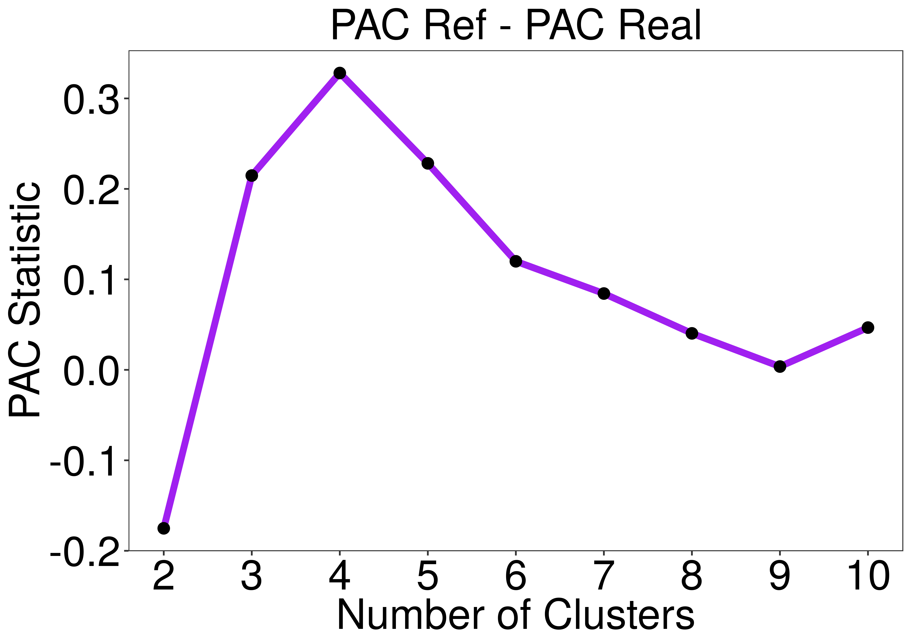

### Abstract

A central task in genome-wide data analyses is class discovery which is accomplished through clustering. However, an unresolved problem with current clustering algorithms is they do not not have a hypothesis testing framework that derives p values for each value of the number of clusters (K). To solve this, we developed a clustering tool with a hypothesis testing framework that uses consensus clustering called Monte Carlo Consensus Clustering (M3C). M3C use a multi-core enabled Monte Carlo simulation to generate a distribution of stability scores for each value of K using null datasets with the same gene-gene correlation structure as the real one. These distributions are used to derive p values and a beta distribution is fitted to the data to cheaply estimate p values beyond the limits of the simulation. M3C improves accuracy, allows rejection of the null hypothesis, removes systematic bias, and uses p values to make class number decisions.

### Prerequisites

**M3C recommended spec:**

A relatively new and fast multi-core computer or cluster.

**M3C requires:**   

A matrix or data frame of normalised genomic expression data (e.g. microarray or RNA-seq) where columns equal samples and rows equal features. For RNA-seq data, VST or rlog transformed count data, log(CPM), log(TPM), and log(RPKM), are all acceptable forms of normalisation.

The data should be filtered to remove features with no or very low signal, and filtered using variance to reduce dimensionality (unsupervised), or p value from a statistical test (supervised).

**M3C also accepts optionally:**

Annotation data frame, where every row is a patient/sample and columns refer to meta-data, e.g. age, sex, etc. M3C will automatically rearrange your annotation to match the clustering output and add the consensus cluster grouping to it. This is done to speed up subsequent analyses. Note, this only works if the IDs (column names in data) match a column called "ID" in the annotation data frame.

### Example workflow

The M3C package contains the GBM cancer microarray dataset for testing. There is an accepted cluster solution of 4. First we load the package which also loads the GBM data.

```{r, message=FALSE}
library(M3C)
library(NMF) # loading for aheatmap plotting function
library(gplots) # loading this for nice colour scale
library(ggsci) # more cool colours

# now we have loaded the mydata and desx objects (with the package automatically)
# mydata is the expression data for GBM
# desx is the annotation for this data
```

### Running M3C

In our example, we run the algorithm using the default settings (100x monte carlo iterations and 100x inner replications). We have found the results generally stable using these parameters, although they may be increased or the algorithm may simply be run a few extra times to test stability. Plots from the tool and an .csv file with the numerical outputs may be printed into the working directory (by adding printres = TRUE). We will set the seed in this example, incase you wish to repeat our results exactly (seed = 123). We will add the annotation file for streamlined downstream analyses (des = desx).

We recommend saving the workspace after M3C if you are working with a large dataset because the runtimes can be quite long. M3C uses by default PAM with Euclidean distance in the consensus clustering loop because we have found this runs fast with better results. The reference method that generates the null datasets is best left to the default setting which is 'reverse-PCA', this maintains the correlation structure of the data using the principle component loadings. We will set the removeplots option to TRUE in this example to remove plots from the vignette, normally this is FALSE by default.

```{r, message=FALSE, results='hide'}
res <- M3C(mydata, cores=1, seed = 123, des = desx, removeplots = TRUE)
```

The scores and p values are contained within the res$scores object. So we can see the RCSI reaches a maxima at K = 4 (RSCI=0.33), the monte carlo p value supports this decision (p=0.033). This means we can reject the null hypothesis that K = 1 for this dataset because we have achieved significance versus a dataset with no clusters (but with an identical gene-gene correlation structure). For p values that can extend beyond the lower limits imposed by the monte carlo simulation we can estimate parameters from the simulation to generate a beta distribution, the BETA_P in this case study is 0.033. We may of course want to take a look at other significant or near significant clustering solutions and how they relate to our variables of investigation.

```{r}
res$scores
```

Now we will take a look at some of the plots M3C generates.  

This is a CDF plot of the GBM data we feed into the algorithm. We are looking for the value of K with the flattest curve and this can be quantified using the PAC metric (Șenbabaoğlu et al., 2014). In the CDF and following PAC plot we can see the overfitting effect of consensus clustering where as K increases so does the apparent stability of the results for any given dataset, this we correct for by using a reference.
\newline  
  


This figure below is the PAC score, we can see an elbow at K = 4 which is suggestive this is the best K. However, we are not able to quantify how confident we are in this value without comparison versus a null dataset. Indeed, this may just be the result of random noise.

{width=90%}

We then derive the relative cluster stability index (RCSI) which takes into account the reference PAC scores, but not the shape of the distribution. This metric is better than the PAC score for deciding class number, where the maximum value corresponds to the best value of K. In this example the RCSI has an optima at K=4. It generally requires fewer iterations than deriving the empirical p values.

{width=90%}

Finally, we calculate a p value from the distribution, here we display the p values from the beta distribution. If none of the p values reach significance over a reasonable range of K (e.g. 10), then we accept the null hypothesis. In the GBM dataset, we can see K = 4 reaches signfiicance with an alpha of 0.05 (red dotted line), therefore we can reject the null hypothesis for the GBM dataset.

{width=90%}

Now we are convinced there are 4 clusters within this dataset which are not likely simply to have occurred by chance alone, we can turn to examine the output objects that M3C generates. These allow heatmap generation for publications.

### Understanding M3C outputs

The first 3 lines below extract the ordered (according in clustering results) expression data and the annotation data from the results object after running M3C. If we wanted to extract the data for 5 clusters, we would simply replace in 4 in the below lines to 5 and so on. We scale the data here row wise according to z-score prior to some light data compression for visualisation purposes in the heatmap. Remember to set Colv = NA for heatmap plotting because we have already ordered the data column or samplewise, M3C does that for you.

```{r,fig.show = 'hide'}
# get the data out of the results list (by using $ - dollar sign)
data <- res$realdataresults[[4]]$ordered_data # this is the data
annon <- res$realdataresults[[4]]$ordered_annotation # this is the annotation
ccmatrix <- res$realdataresults[[4]]$consensus_matrix # this is the consensus matrix

# normalise and scale the data
data <- t(scale(t(data))) # z-score normalise each row (feature)
data <- apply(data, 2, function(x) ifelse(x > 4, 4, x)) # compress data within range
data <- apply(data, 2, function(x) ifelse(x < -4, -4, x)) # compress data within range

# get some cool colour palettes from the ggsci package and RColourBrewer
ann_colors <- ggsci::pal_startrek("uniform")(4) # star trek palette
ann_colors2 <- ggsci::pal_futurama()(4) # futurama palette
pal <- rev(colorRampPalette(RColorBrewer::brewer.pal(10, "RdBu"))(256))
NMF::aheatmap(data, annCol = annon, scale = 'row', Colv = NA, distfun = 'pearson', 
         color = gplots::bluered(256), annColors = list(class=ann_colors, consensuscluster=ann_colors2))

```


A last plot we may want to do for publications is print the consensus matrix for our optimal clustering solution (in this case, K = 4). This should be quite crisp reflecting the significant stability of the results. We can see in this heatmap below of the consensus matrix the clusters do indeed look quite clear supporting our view that there is 4 clusters.

```{r,fig.show = 'hide'}
# time to plot the consensus matrix for the optimal cluster decision
ccmatrix <- res$realdataresults[[4]]$consensus_matrix # pull out the consensus matrix from the k = 4 object
pal <- rev(colorRampPalette(RColorBrewer::brewer.pal(9, "Reds"))(256)) # get some nice colours
NMF::aheatmap(ccmatrix, annCol = annon, Colv = NA, Rowv = NA, 
              color = rev(pal), scale = 'none') # plot the heatmap
```


So we have now covered the basic use of M3C. Generally, we recommend the complexheatmap package for rendering of heatmaps as it is more customisable for publications, however, the aheatmap function (from the NMF package) is also nice and easier to use.

Lastly, we will now examine an extra function of the package, which can be used for benchmarking clustering tools.

### Generating simulated data

We have included a function for generating simulated data to test various clustering algorithms. This cluster simulator is simple to use. Using the code below, clustersim generates a dataset with 225 samples, 900 features, a radius cut-off for the initial square of 8, a cluster number of 4, a seperation of clusters of 0.75, and a degree of noise added to each co-ordinate of 0.025. After running, a PCA will print of the data so we can visualise the 4 clusters in principle component space.

```{r,fig.show = 'hide',message=FALSE,results='hide'}
  res <- clustersim(225, 900, 8, 4, 0.75, 0.025, print = FALSE, seed=123)
```

{width=80%}

### Conclusions

In this tutorial, we have seen that M3C provides a rigourous approach for selecting the number of clusters in the data opposed to relying on relative scores. We have found in our analyses this approach results in increased performance relative to other methods and the removal of systematic bias inherant in the results. Building on prior work (Tibshirani et al., 2001; Șenbabaoğlu et al., 2014), M3C represents a conceptual step forward for class discovery algorithms.

### References

Monti, Stefano, et al. "Consensus clustering: a resampling-based method for class discovery and visualization of gene expression microarray data." Machine learning 52.1 (2003): 91-118.

Șenbabaoğlu, Yasin, George Michailidis, and Jun Z. Li. "Critical limitations of consensus clustering in class discovery." Scientific reports 4 (2014): 6207.

Tibshirani, Robert, Guenther Walther, and Trevor Hastie. "Estimating the number of clusters in a data set via the gap statistic." Journal of the Royal Statistical Society: Series B (Statistical Methodology) 63.2 (2001): 411-423.


