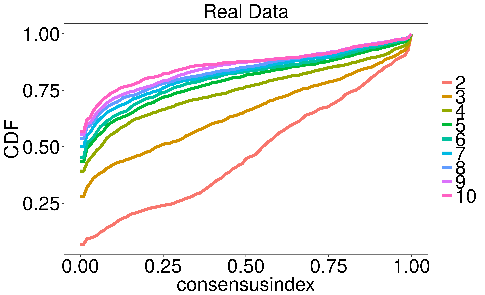
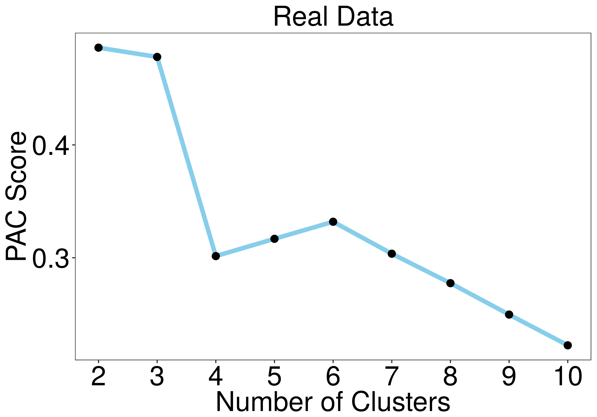
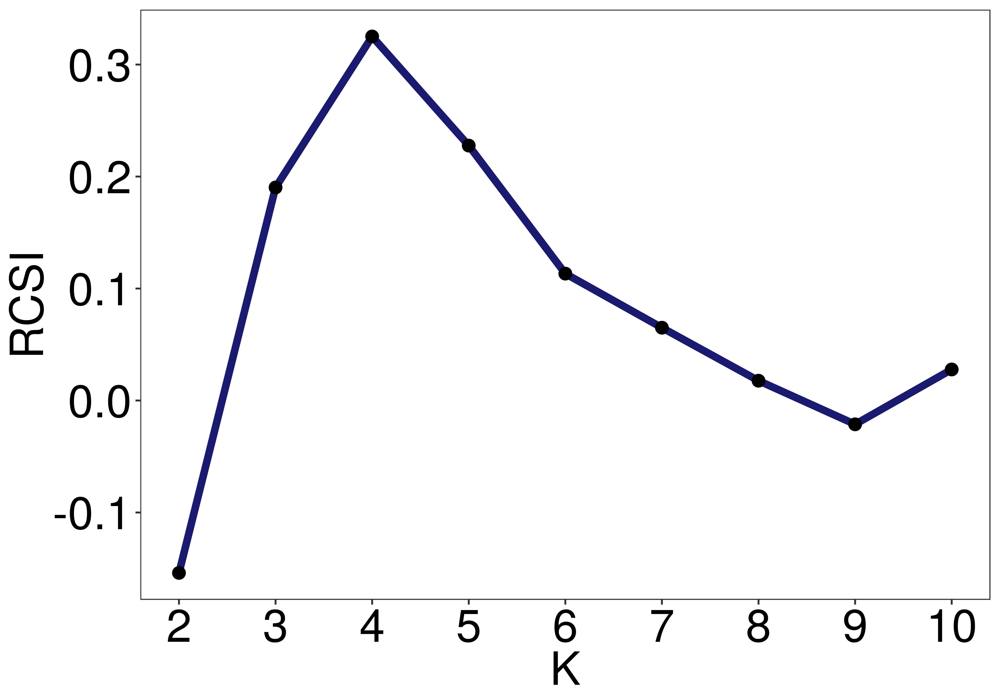
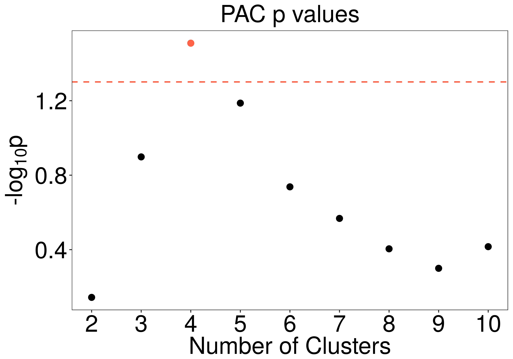
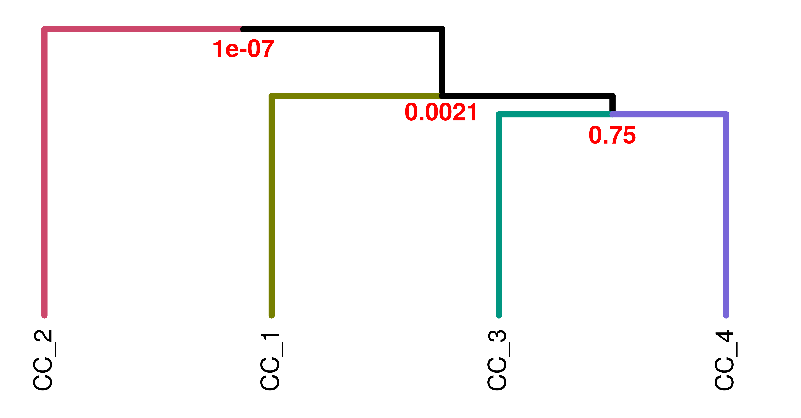
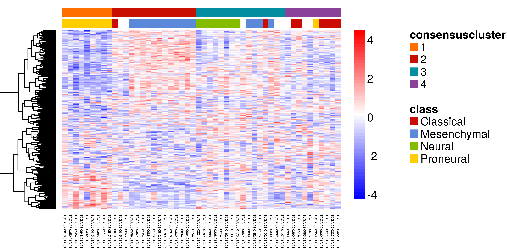
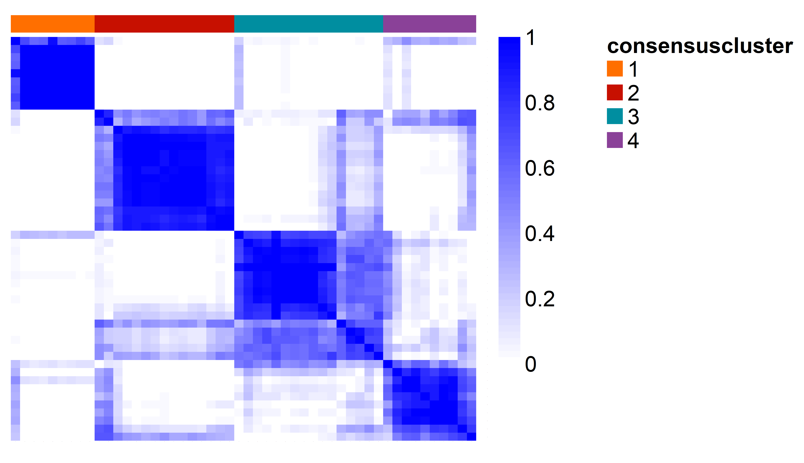
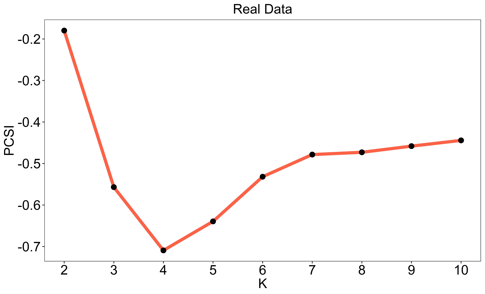
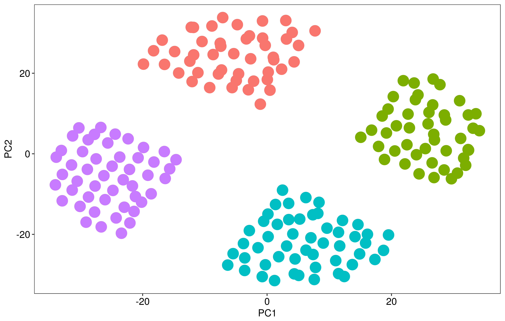

# Abstract

Genome-wide expression data is used to stratify patients into classes using clustering algorithms for precision medicine. The Monti consensus clustering algorithm is a widely applied method to identify the number of clusters (K), however; it has inherant bias towards greater values of K and yields high numbers of false positives. As a solution, we developed Monte Carlo reference-based consensus clustering (M3C) (John et al., 2018). M3C uses a Monte Carlo simulation to generate null distributions of stability scores along the range of K which are used when deciding the optimal value. Using a reference, that maintains the correlation structure of the input features, improves on the limitations of consensus clustering. M3C uses the Relative Cluster Stability Index (RCSI) and p values to decide on the value of K and reject the null hypothesis, K=1. 

# Prerequisites

**M3C recommended spec**

For the Monte Carlo simulation (method=1), M3C is best run on a relatively new and fast multi-core computer or cluster. If your machine is not particuarly fast, you can reduce the Monte Carlo iterations down to 10-50x. 

The second method (method=2) that uses a penalty term to eliminate overestimation of K is faster, but you will not get p values for each value of K.

**M3C requires**   

A matrix or data frame of normalised continuous expression data (e.g. microarray, RNA-seq, methylation arrays, protein arrays) where columns equal samples and rows equal features. M3C's reference will work better if the feature data is approximately normally distributed across biological replicates.

For example, for RNA-seq data, VST or rlog transformed count data, log2(CPM), log2(TPM), and log2(RPKM), are all acceptable forms of normalisation.

The data should be filtered to remove features with no or very low signal, and filtered using variance to reduce dimensionality (unsupervised), or p value from a statistical test (supervised). We include a feature filter function that uses the coefficient of variation in the package which is demonstrated later in the vignette. This function also provides a number of other useful statistics for each gene.

Outliers should be removed, we include an easy to use PCA function which has a text label parameter to help remove outliers (type ?pca for more information).

We recommend M3C only be used to cluster datasets with high numbers of samples (e.g. 60-1000). M3C is mainly aimed at large patient cohort datasets such as those produced by TCGA and other consortia. Because of the high complexity of the algorithm and the type of consensus matrix it makes, it is not suited for single cell RNA-seq data, better to use SC3 or Seurat, for example.

**M3C also accepts optionally**

Annotation data frame, where every row is a patient or sample and columns refer to meta-data, e.g. age, sex, time until death, etc. M3C will automatically rearrange your annotation to match the clustering output and add the consensus cluster grouping to it. Note, this only works if the IDs (column names in data) match the entries in a column called "ID" in the user supplied annotation data frame.

M3C also accepts clinical or biological data for a basic statistical analysis with the discovered classes. Again the 'ID' column must exist in the annotation data frame. If the data is continuous or categorical, a Kruskal-Wallis or chi-squared test are performed, respectively. For these two tests, a 'variable' parameter must be given which is a string that defines the dependent variable in the users annotation data frame. If the data is survival data for cancer, the annotation data frame must have an 'ID' column first, followed by a 'Time' and 'Death' column (where 0 is no death and 1 is death or time until last visit). 

# Example workflow I: TCGA glioblastoma dataset

The M3C package contains the glioblastoma (GBM) cancer microarray dataset for testing (reduced to 50 samples randomly). The original optimal cluster decision was 4. First, we load M3C which also loads the GBM data.

```{r, message=FALSE}
library(M3C)
library(NMF) # loading for aheatmap function
library(gplots) # has a nice colour scale
library(ggsci) # more cool colours

# now we have loaded the mydata and desx objects (with the package automatically)
# mydata is the expression data for GBM
# desx is the annotation for this data
```

## Exploratory data analysis

This is an important exploratory step prior to running M3C. It is best to remove extreme outliers. It is also important to be aware of the assumptions of PAM, K-means, and HC. K means, PAM, and HC assume the following;

i) Clusters are approximately spherical - not severely elongated in one direction (anisotropic) or non-linear
ii) Clusters are approximately equal in variance

You can read more about the assumptions of clustering algorithms here:
(http://scikit-learn.org/stable/modules/clustering.html)

Spectral clustering may be used to cluster more unusual structures using M3C, but this normally is not necessary. Ward's hierarchical clustering (HC) is faster than these 3 algorithms and is an option included in M3C, although in practice PAM and KM usually perform better.

It is also extremely important to check batch effects and other unwanted sources of variation do not drive the main variation in the data. The PCA function has a labels flag for adding categorical and continuous variables to the below plot (type ?pca), but for a more quantitative analysis of these variables before clustering we recommend David Watson's plot_drivers function from the bioplotr package (https://github.com/dswatson/bioplotr).

```{r, message=FALSE, results='hide'}
PCA1 <- pca(mydata)
```


## Running M3C

In our example, we run the algorithm using the default settings (100x Monte Carlo iterations and 100x inner replications). We have found the results generally stable using these parameters. If you are running a slow machine, have a massive dataset, or want results quickly, it is reasonable to lower the Monte Carlo iterations parameter to 50-5x. The inner replications needs to be at least 100x, changing this up to 250x will lead to increased result stability on some datasets. If your features are on different scales it is helpful to scale the data before cluster analysis.

Plots from the tool and an .csv file with the numerical outputs may be printed into the working directory (by adding printres = TRUE). We will set the seed in this example, incase you wish to repeat our results exactly (seed = 123). We will add an annotation file for streamlined downstream analyses (des = desx), and because we are comparing the classes with a categorical variable (tumour type) we shall set 'doanalysis' to TRUE and 'analysistype' to 'chi', to do a chi-squared test for significance. The 'variable' parameter is set to class (tumour histology in this data).

It is recommended to save the workspace after M3C if you are working with a large dataset because the runtimes can be quite long. M3C uses by default PAM with Euclidean distance in the consensus clustering loop because we have found this runs fast with good results. We will set the 'removeplots' parameter to TRUE in this example to remove plots from the vignette, normally this is FALSE by default.

```{r, message=FALSE, results='hide'}
res <- M3C(mydata, cores=1, seed = 123, des = desx, removeplots = TRUE, analysistype = 'chi', doanalysis = TRUE, variable = 'class')
```

The scores and p values are contained within the res$scores object. We can see below the RCSI reaches a maxima at K = 4 (RSCI=0.33), the Monte Carlo p value supports this optimal K decision (p=0.033). This means the null hypothesis that K = 1 can be rejected for this dataset because we have achieved significance (alpha=0.05) versus a dataset with no clusters. For p values that extend beyond the lower limits imposed by the Monte Carlo simulation, M3C estimates parameters from the simulation to generate a beta distribution. The BETA_P in this case study is 0.033.

```{r}
res$scores
```

Also important is the relationship between the clinical variables and the discovered clusters. In this data we want to compare with a categorical variable so perform a chi-squared test. We are reassured to see below K=4 is highly significant (p=5.5x10-14), however, K=5 is slightly more so. It is important to bear in mind the clinical or biological relationships as well as the structural nature of the data when deciding K.

```{r}
res$clinicalres
```

Now we will take a look at some of the plots M3C generates.  

This is a CDF plot of the consensus matrices for our test data. We are looking for the value of K with the flattest curve and this can be quantified using the PAC metric (Senbabaoglu et al., 2014). In the CDF and following PAC plot we can see the inherant bias of consensus clustering where as K increases so does the apparent stability of the results for any given dataset, this we correct for by using a reference.
\newline  
  


This figure below is the PAC score, we can see an elbow at K = 4 which is suggestive this is the best K. However, the bias of the PAC score can be seen here as it naturally tends towards lower values as K increases, thus making selecting K without taking this into account challenging to say the least. Furthermore, the PAC score cannot reject the null hypothesis K=1, for that we have introduced p values into the consensus clustering methodology. 

{width=90%}

We then derive the Relative Cluster Stability Index (RCSI) which takes into account the reference PAC scores using the reference mean. This metric is better than the PAC score for deciding class number, where the maximum value corresponds to the optimal K. In this example the RCSI has an optima at K=4. We recommend the RCSI be used to select K, and the p values to reject the null in most cases.

{width=90%}

Finally, we calculate a p value from the distribution, here we display the p values from the beta distribution. If none of the p values reach significance over a reasonable range of K (e.g. 10), then we accept the null hypothesis. In the GBM dataset, we can see K = 4 reaches signfiicance with an alpha of 0.05 (red dotted line), therefore we can reject the null hypothesis K=1 for the GBM dataset.

{width=90%}

Now we are pretty convinced there are 4 clusters within this dataset which are not likely simply to have occurred by chance alone. 

A further analysis that M3C conducts (if the dend flag is set to TRUE) is to make a dendrogram for the optimal K using the consensus cluster medoids, then sigclust is run to calculate p values for each branchpoint. This allows quantification of the structural relationships between consensus clusters. In this case CC3 and CC4 have a closer relationship, whilst the other clusters are quite far apart.



We can turn to examine the output objects that M3C generates. These allow heatmap generation for publications.

## Understanding M3C outputs

The first 3 lines below extract the ordered (according in clustering results) expression data and the ordered annotation data from the results object after running M3C for a 4 cluster solution. If we, for example, wanted to extract the data for a 5 cluster solution from the M3C results list, we would simply replace 4 in the below lines to 5. We then take a brief glance at the annotation object M3C outputs, a consensus cluster column has been added by M3C. 

```{r,fig.show = 'hide'}
# get the data out of the results list (by using $ - dollar sign) for K=4
data <- res$realdataresults[[4]]$ordered_data # this is the data
annon <- res$realdataresults[[4]]$ordered_annotation # this is the annotation
ccmatrix <- res$realdataresults[[4]]$consensus_matrix # this is the consensus matrix
head(annon)
```

Next, we scale the data here row wise according to z-score, prior to some light data compression for visualisation purposes in the heatmap. Remember to set Colv = NA for heatmap plotting because the data columns (samples) are already ordered.

Note, we are going to use the NMF aheatmap function to draw the heatmap because it is simple, but for more complex heatmap designs for publication, ComplexHeatmap is definately preferable (https://bioconductor.org/packages/release/bioc/html/ComplexHeatmap.html).

```{r,fig.show = 'hide'}
# normalise and scale the data
data <- t(scale(t(data))) # z-score normalise each row (feature)
data <- apply(data, 2, function(x) ifelse(x > 4, 4, x)) # compress data within range
data <- apply(data, 2, function(x) ifelse(x < -4, -4, x)) # compress data within range

# get some cool colour palettes from the ggsci package and RColourBrewer
ann_colors <- ggsci::pal_startrek("uniform")(4) # star trek palette
ann_colors2 <- ggsci::pal_futurama()(4) # futurama palette
pal <- rev(colorRampPalette(RColorBrewer::brewer.pal(10, "RdBu"))(256))
NMF::aheatmap(data, annCol = annon, Colv = NA, distfun = 'pearson', 
         color = gplots::bluered(256), annColors = list(class=ann_colors, consensuscluster=ann_colors2))

```



Another plot we may want to do for publications is print the consensus matrix for our optimal clustering solution (in this case, K = 4). This should be quite crisp reflecting the significant stability of the results. We can see in this heatmap below of the consensus matrix the clusters do indeed look quite clear supporting our view that there is 4 clusters. 

Viewing consensus matrices manually should not be used to decide K, better to use the RCSI or p values that M3C provides to quantify the mixing proportions in the consensus matrix versus the K=1 null model. We also caution against the use of cluster validity metrics on the consensus matrices without first testing their behaviour in details on simulated positive control datasets. Our data indicates that these metrics may have substantial bias in them as well due to the underlying method.

```{r,fig.show = 'hide'}
# set up colours
n <- 10
seq = rev(seq(0,255,by=255/(n)))
palRGB = cbind(seq,seq,255)
mypal <-rgb(palRGB,maxColorValue=255)
# plot consensus matrix heatmap, do not cluster rows and columns
NMF::aheatmap(ccmatrix, 
              annCol = annon[,1,drop=FALSE], 
              color = mypal, scale = 'none', cexRow = 0, cexCol = 0,
              Colv=NA,Rowv=NA,annColors = list(consensuscluster=ann_colors2))
```



## Final check of consensus cluster structure

A last analysis we recommend to do is to examine how the clusters are arranged in principal component and t-SNE latent variable space. To do this the pca and t-SNE functions can be run directly on the M3C output object. We may need to experiment with the perplexity parameter of t-SNE in the range of 5-20 to better suit the data. Both functions can also be used to print their results to the working directory. It is also possible to run UMAP on the data in a streamlined manner, see ?umap.

```{r,fig.show = 'hide',message=FALSE,results='hide'}
  PCA2 <- pca(res, K=4)
  TSNE <- tsne(res, K=4, perplex=15)
```

We can see in the PCA and t-SNE plots that clusters 3 and 4 are closer together. Doing a visual check like this allows the user to ensure there are no obvious artifacts that have occured. 


# Example workflow II: Fast penalty method

## Running M3C in fast mode

The second method minimises log(PAC) subject to lambda*K to find the optimal K. This metric is called the Penalised Cluster Stability Index (PCSI). 

We recommend using this method if the user has a massive dataset or little time. It will correct for the overestimation of K observed with the PAC score.

```{r,fig.show = 'hide',message=FALSE,results='hide'}
res <- M3C(mydata, method = 2)
```

Here we can see the PCSI is minimised at K=4, this is the optimal K using this method.



# Additional functions

## Generating simulated data

We have included a function for generating simulated data to test various clustering algorithms. This cluster simulator is simple to use. Using the code below, clustersim generates a dataset with 225 samples, 900 features, a radius cut-off for the initial square of 8, a cluster number of 4, a seperation of clusters of 0.75, and a degree of noise added to each co-ordinate of 0.025. After running, a PCA will print of the data so we can visualise the 4 clusters in principle component space. 

Note, clustersim's method has recently been replaced with the CRAN package, clusterlab. We recommend using this for more sophisticated benchmarking. Clusterlab can generate Gaussian clusters with controlled variance and spacing, it can also create more complex higher order structures.

```{r,fig.show = 'hide',message=FALSE,results='hide'}
  res <- clustersim(225, 900, 8, 4, 0.75, 0.025, print = FALSE, seed=123)
```

{width=80%}

## Filtering features by the coefficient of variation

A simple feature filter function has been included in M3C that uses one of variance, Pearson's coefficient of variation (A), or its second order derivative (A2) to filter the data. It is best to examine the distribution of variance with respect to the mean and its density with respect to all features when selecting a filtering metric and cut-off. We suggest to do some manual examination and plotting, for example, with the qplot function from ggplot2 of the mean-variance trend. If the variance increases with the mean, A or A2 may be more appropiate than variance. 

The statistics for each feature (and the filtered data itself) are saved in a convienient data frame in the results list. 

Below, we set the percentile to filter by and input the data. The code below extracts the 10% most variable features using variance as the filtering metric. The statistics for the topN features will be printed to the console. Type ?featurefilter for more information.

```{r}
  filtered_results <- featurefilter(mydata, percentile=10, method='var', topN=5)
```

# Closing comments

In this tutorial, we have seen that M3C provides a rigourous approach for selecting the number of clusters in the data. We have found in our analyses this approach results in increased performance relative to other methods and the removal of systematic bias inherant in the results. M3C's methodological and software developments are primarily built on the work of Tibshirani et al. (2001), Senbabaoglu et al. (2014), and Monti et al. (2003). Notably, it is best to use M3C after careful consideration of the format of the data, its normalisation and transformation, correction for any batch effects, and in conjunction with dimensionality reduction tools such as PCA and t-SNE to confirm the structure.

During the development of M3C, we also devised a flexible method and associated CRAN package for generating Gaussian clusters called, clusterlab (https://cran.r-project.org/web/packages/clusterlab/index.html). This tool should prove useful in testing the performance of class discovery algorithms.

For fast clustering of multi-omic data, we recommend Spectrum (https://cran.r-project.org/web/packages/Spectrum/index.html) (John et al., 2019). Spectrum is a self-tuning spectral clustering algorithm that can integrate heterogenous data sources and reduce noise. It uses a tensor product graph data integration and diffusion procedure, a density-aware kernel, and contains a data compression method to cluster 1000s of samples quickly. The method is also effective on the single view situation.

# References

John, Christopher Robert, et al. "M3C: A Monte Carlo reference-based consensus clustering algorithm." bioRxiv (2018): 377002.

John, Christopher R., et al. "Spectrum: Fast density-aware spectral clustering for single and multi-omic data." BioRxiv (2019): 636639.

Monti, Stefano, et al. "Consensus clustering: a resampling-based method for class discovery and visualization of gene expression microarray data." Machine learning 52.1 (2003): 91-118.

Kvålseth, Tarald O. "Coefficient of variation: the second-order alternative." Journal of Applied Statistics 44.3 (2017): 402-415.

Senbabaoglu, Yasin, George Michailidis, and Jun Z. Li. "Critical limitations of consensus clustering in class discovery." Scientific reports 4 (2014): 6207.

Tibshirani, Robert, Guenther Walther, and Trevor Hastie. "Estimating the number of clusters in a data set via the gap statistic." Journal of the Royal Statistical Society: Series B (Statistical Methodology) 63.2 (2001): 411-423.


