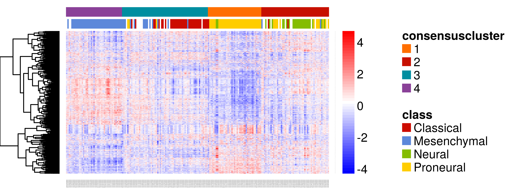
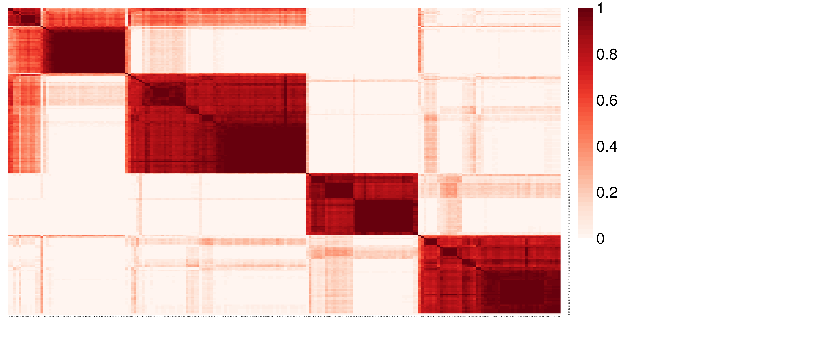
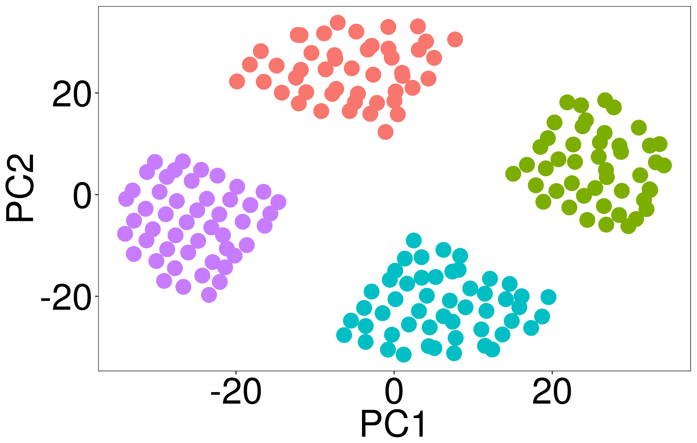
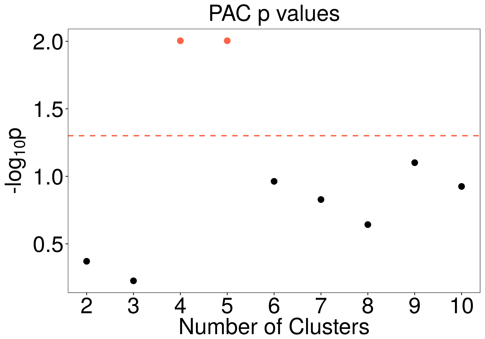
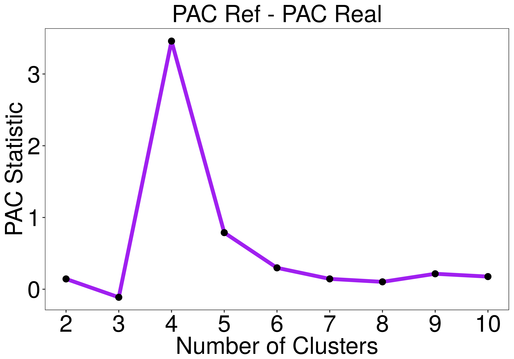

### Abstract

An critical task in genomic data analyses is class discovery which is typically accomplished through clustering. We have created a new consensus clustering algorithm and implementation based on the work by Monti et al. (2001) and Șenbabaoğlu et al. (2014). The original algorithm aimed to solve class number decision using a resampling method and produced a consensus rate (a measure of cluster solution stability). However, this approach did not use a reference datset and test the null hypothesis. This is why we developed Monte Carlo Consensus Clustering (M3C). M3C use a multi-enabled monte carlo simulation to generate a distribution of PAC (proportion of unambiguous clustering) scores from a null dataset, with the same gene-gene correlation structure as the real, for deriving A) the PAC statistic and B) an empirical p value. These two metrics substantially improve accuracy, allow rejection of the null hypothesis K = 1, and provide confidence in the form of a p value for different clustering solutions. We believe this approach deals with a number of pitfalls in current clustering approaches in stratified medicine.

### Prerequisites

**M3C recommended spec:**

A relatively new and fast multi-core computer or cluster.

**M3C requires:**   

A matrix or data frame of normalised expression data (e.g. microarray or RNA-seq) where columns equal samples and rows equal features. The requirement of the reference generation method is the features should be approximately normal, e.g. log(TPM) or rlog transformed data for RNA-seq.

The data should be filtered to remove features with no or very low signal, and filtered for variance to reduce dimensionality (unsupervised), or p value from a statistical test (supervised).

**M3C also accepts optionally:**

Annotation data frame, where every row is a patient/sample, columns refer to meta-data e.g. age, sex. M3C will automatically rearrange your annotation to match the clustering output and add the consensus cluster to it. Note, this only works if the IDs (column names in data) match a column called "ID" in the annotation data frame.

### Example workflow

The M3C package contains the GBM cancer microarray dataset. There is an accepted cluster solution of 4. First we load the package which also loads the GBM data.

```{r, eval = FALSE}
library(M3C)
library(NMF) # loading for aheatmap plotting function
library(gplots) # loads for cool colour scale
library(ggsci) # more colours

# now we have loaded the mydata and desx objects
# mydata is the expression data for GBM
# desx is the annotation for this data
```

### Running M3C

Next, we run the algorithm with 100x monte carlo simulations and 100x inner replications for the real data and reference. These parameters can be increased later for added stability. A final analysis can be done with 1000x monte carlo simulations later. Plots from the tool and an .csv file with the numerical outputs are printed into the working directory (printres = T). We will set the seed in this example, incase you wish to repeat our results exactly. We will add the annotation file for easy plotting later on (des = desx).

We always recommend saving the workspace after M3C if running higher numbers of iterations, because the runtimes can be long. We have removed hierarchical clustering and k means from this algorithm, because they performed poorly in our simulations or too slow relative to PAM. M3C uses PAM with Euclidean distance. The reference method that generates the null datasets is best left to the default setting which is 'reverse-PCA'.

```{r, eval = FALSE}
res <- M3C(mydata, cores=8, iters=100, ref_method = 'reverse-pca', montecarlo = T,
                         printres = T, maxK = 10, showheatmaps = F, repsreal = 100, repsref = 100,
                         printheatmaps = T, seed = 123, des = desx)
```

The scores and p values are contained within the res$pac_scores object. So we can see the PAC_STAT reaches a maxima at K = 4 (pac_stat=0.45), and the p value supports this decision (p=0.0099). This means we can reject the null hypothesis that K = 1 for this dataset because we have achieved significance versus a dataset with no clusters, but with the same gene-gene correlation structure. For more accurate p values 1000 iterations may be used. Extrapolated p values are provided which estimate the p value when the observed statistic exceeds all those in the simulations, estimation is via a non parametric method that uses the extreme tail end of the distribution (Davis et al., 1984).

We can see the automated decision making for K which is simply the lowest P_VALUE. If the p values are tied we take the lowest p value with the higher PAC_STAT. In this case it is straightforward, however, we may also want to look at K=5 and base our choice on the biology as well.

```{r, eval = FALSE}
   K  PAC_REAL   PAC_REF   PAC_STAT    P_VALUE   P_SCORE P_EXTRAPOLATED    decision
1  2 0.4837761 0.4997701 0.03252604 0.44554455 0.3511089             NA sub optimal
2  3 0.4755906 0.5266180 0.10191793 0.21782178 0.6618987             NA sub optimal
3  4 0.2999706 0.4722204 0.45376132 0.00990099 2.0043214    0.003504677     optimal
4  5 0.3152142 0.4136991 0.27188662 0.01980198 1.7032914             NA sub optimal
5  6 0.3302617 0.3616464 0.09078147 0.14851485 0.8282301             NA sub optimal
6  7 0.3020782 0.3179424 0.05118409 0.25742574 0.5893480             NA sub optimal
7  8 0.2761004 0.2838727 0.02776125 0.38613861 0.4132568             NA sub optimal
8  9 0.2484070 0.2568552 0.03344394 0.32673267 0.4858074             NA sub optimal
9 10 0.2213018 0.2343599 0.05733030 0.25742574 0.5893480             NA sub optimal
```

Next, we will take a look at some of the plots M3C generates.  

This is a CDF plot of the GBM data we feed into the algorithm. We are looking for the value of K with the flattest curve and this can be quantified using the PAC metric (Șenbabaoğlu et al., 2014). Note, we have removed delta K from the algorithm because as we have recently shown, it performs badly. In the CDF plot we can see the overfitting effect of consensus clustering where as K increases so does the apparent stability of the solution, this we correct for by using a reference.
\newline  
  
{width=50%}

This figure below is the PAC score, we can see an elbow at K = 4 which is suggestive this is the best K. However, we are not able to quantify how confident we are in this value without comparison versus a null dataset. Indeed, this may just be random noise.

{width=40%}

We then derive the PAC statistic which takes into account the reference PAC scores. This metric should be used instead of the PAC score for deciding class number, where the maxima is the number of clusters in the data. In this example it is 4. Note, the biology is of course important as well, so we may want to have a look at K = 5.

{width=40%}

Finally we calculate a p value from the distribution. This adds a measure of confidence to the PAC statistic and can be used to support arguments there is genuine structure in the data opposed to just noise. If p values do not reach significance it is implying the dataset is more similar to random data. In the GBM dataset we can see K = 4 and K = 5 reach signfiicance with an alpha of 0.05 and K = 4 is the most significant.

{width=40%}

Now we are convinced there are 4 clusters within this dataset which are not likely simply to have occurred by chance alone we can turn to examine the output objects that M3C generates. These facilitate clustering and heatmap rendering for publication.

### Understanding M3C outputs

The first 3 lines below extract the expression data and the annotation data from the results object after running M3C. If we wanted to extract the data for 5 clusters, we would simply replace in 4 in the below lines to 5 (and so on). We scale the data here row wise according to z-score prior to some light compression for visualisation purposes in the heatmap. Remember to set Colv = NA for heatmap plotting because we have already ordered the data column or samplewise, M3C does that for you.

```{r, eval = FALSE}
# get the data out of the results list (by using $ - dollar sign)
data <- res$allresults[[4]]$ordered_data # this is the data
annon <- res$allresults[[4]]$ordered_annotation # this is the annotation
ccmatrix <- res$allresults[[4]]$consensus_matrix # this is the consensus matrix

# normalise and scale the data
data <- t(scale(t(data))) # z-score normalise each row (feature)
data <- apply(data, 2, function(x) ifelse(x > 4, 4, x)) # compress data within range
data <- apply(data, 2, function(x) ifelse(x < -4, -4, x)) # compress data within range

# get some cool colour palettes from the ggsci package and RColourBrewer
ann_colors <- ggsci::pal_startrek("uniform")(4) # star trek palette
ann_colors2 <- ggsci::pal_futurama()(4) # futurama palette
pal <- rev(colorRampPalette(RColorBrewer::brewer.pal(10, "RdBu"))(256))
NMF::aheatmap(data, annCol = annon, scale = 'row', Colv = NA, distfun = 'pearson', 
         color = gplots::bluered(256), annColors = list(class=ann_colors, consensuscluster=ann_colors2))

```

{width=70%}

The last thing we may want to do for publications is print the consensus matrix for our optimal clustering solution (K = 4), this should be quite crisp reflecting the flat distribution of the CDF. Note, we could have printed all the consensus heatmaps into the current directory using 'printheatmaps = T', however, in this case we will show how to extract the matrix, cluster and render it with the aheatmap function from the NMF package. We can see in this heatmap of the consensus matrix the clusters look quite clear supporting our view that there is 4 clusters.

```{r, eval = FALSE}
# time to plot the consensus matrix for the optimal cluster decision
ccmatrix <- res$allresults[[4]]$consensus_matrix # pull out the consensus matrix from the k = 4 object
pal <- rev(colorRampPalette(RColorBrewer::brewer.pal(9, "Reds"))(256)) # get some nice colours
NMF::aheatmap(ccmatrix, annCol = annon, Colv = NA, Rowv = NA, color = rev(pal), scale = 'none') # plot the heatmap
```

{width=56%}

So we have now covered how to use the tool. Generally we recommend complexheatmap for publication clustering as it is more customisable, however, aheatmap (from the NMF package) is also nice and easy to use. 

Happy cluster hunting!

Note: we will now turn to an extra function of the package, which is not necessary to learn how to use in order to find clusters in your data, but we have used in our benchmarking.

### Generating simulated data

We have included a function for generating simulated data as part of the package to test clustering algorithms. This cluster simulator is simple to use. This simulator, using the code below, generates a dataset with 225 samples, 900 features, a radius cut-off for the initial square of 8, a cluster number of 4, a seperation of clusters of 0.75, and a degree of noise added to each co-ordinate of 0.025. After running, a PCA will print of the data so we can visualise the 4 clusters in principle component space.

```{r, eval = FALSE}
  res <- clustersim(225, 900, 8, 4, 0.75, 0.025, print = T, seed=123)
  sim <- res$simulated_data # we extract the simulated data from the results list
  mydata <- as.data.frame(sim) # convert to data frame
```

{width=42%}

We can now run M3C to evaluate the clusters in this well seperated example.

```{r, eval = FALSE}
res <- M3C(mydata, cores=8, iters=100, ref_method = 'reverse-pca', montecarlo = T,
                         printres = F, maxK = 10, showheatmaps = F, repsreal = 100, repsref = 100,
                         printheatmaps = F, seed = 123)
```

Now let's take a look at the results. Below we can see because these are very well seperated clusters that the p values reach a minimum quite easily and we have 4 and 5 both as optimal solutions using 100 iterations. However, in these situations we can just use the PAC-statistic to work out the optimal number of clusters.

{width=40%}

Now, using the PAC-statistic, we can see that 4 is clearly the number of clusters in this toy dataset. Normally, biological datasets are noisy and the groups are not well seperated so the p value method would be more effective, as we can seen in our own analyses.

{width=37.5%}

### Conclusions

In this tutorial, we have seen that M3C can provide statistical validation of clustering results as well as using relative scores. Although our monte carlo approach is computationally expensive, this is justified by 3 reasons; 1) increased performance relative to other methods, 2) the ability to reject the null hypothesis, 3) To assess confidence of the results using a p value instead of a relative score. In our studies of real data, we have seen M3C effectively drives class discovery throughout different stratified medicine projects.

### References

Davis, Richard, and Sidney Resnick. "Tail estimates motivated by extreme value theory." The Annals of Statistics (1984): 1467-1487.

Monti, Stefano, et al. "Consensus clustering: a resampling-based method for class discovery and visualization of gene expression microarray data." Machine learning 52.1 (2003): 91-118.

Șenbabaoğlu, Yasin, George Michailidis, and Jun Z. Li. "Critical limitations of consensus clustering in class discovery." Scientific reports 4 (2014): 6207.


